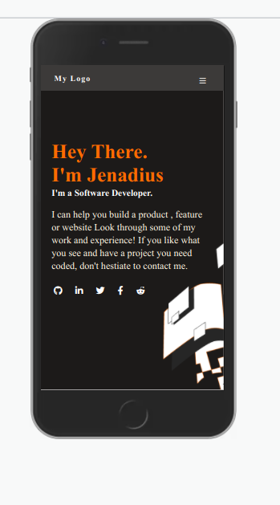

# My  portfolio site

This website is going to consist of all you need to know about my career , contacts and  the projects i worked , working and will work on ,

## Built With

- Html and css

## Live Demo

[Live Demo Link](https://jenadiusnicholaus.github.io/my-portfolio-site/)

## Prerequisites

- Html and css

## Author

 Jenadius Nicholaus

- GitHub: *[@jenadiusnicholaus](https://github.com/jenadiusnicholaus/)*.

- Twiter: *[@jenadius_kaim](https://twitter.com/jenadius_kaim)*.

- LinkedIn: *[@jenadiusnicholaus](https://www.linkedin.com/in/jenadius-nicholaus-73126819b/)*.

 Contributing

 Contributions, issues, and feature requests are welcome!

## Acknowledgments

- Hat tip to anyone whose code was used
- Inspiration
- etc
